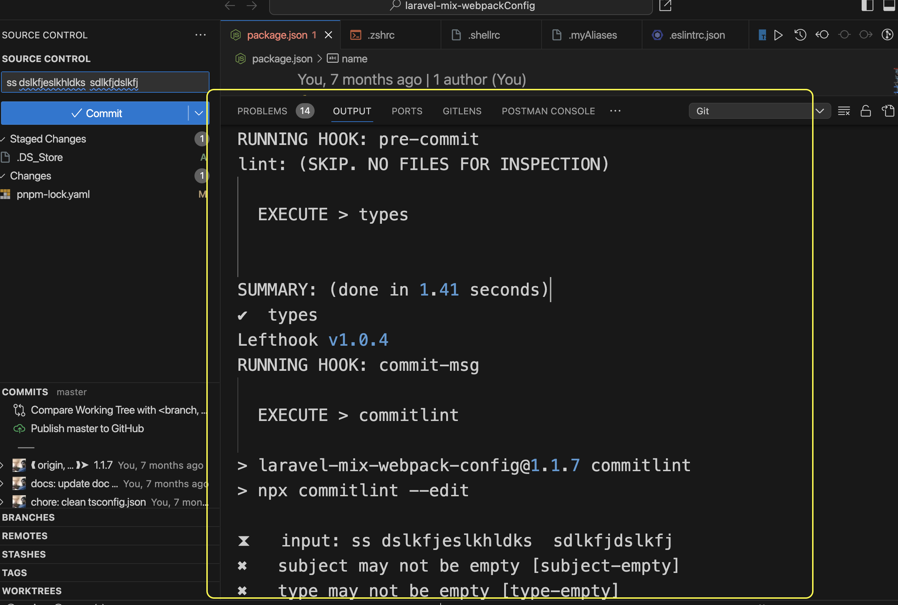
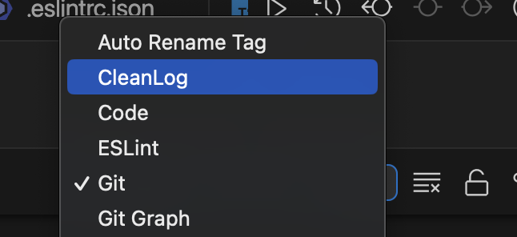
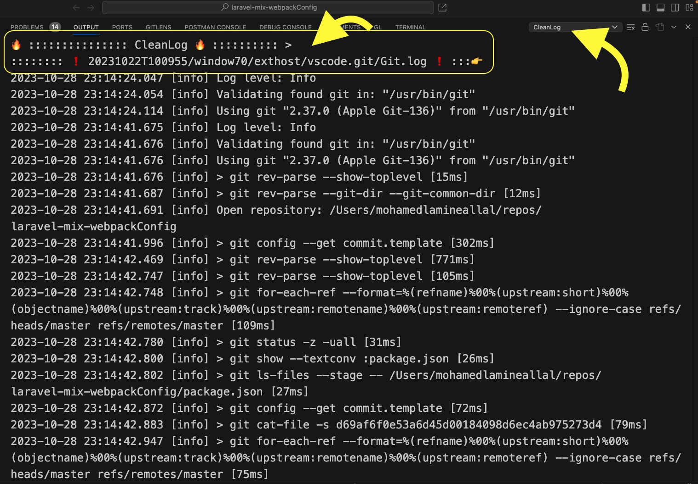
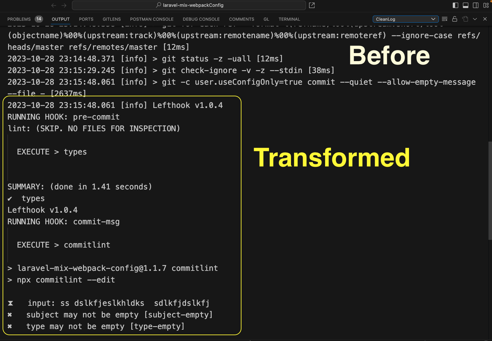
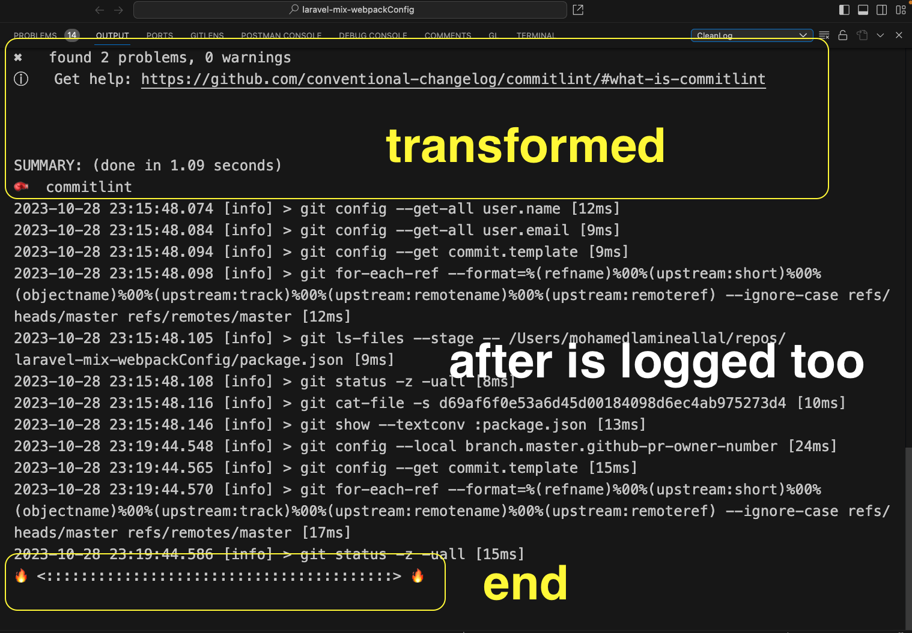

# ✨ Vscode-clean-output-log ✨ ( CleanLog )

## The issue

- Have you ever encountered the output panel red character. And misformed output ???


- It's a very known vscode problem
- Mainly. The tools like `commitlint`, `lefthook`, `husky` as an example. And just about any others (testing tools ....). If they use `ANSI escape colors codes` in there output. Then we will get the red character with the color code as in the pic above, due to the ANSI codes that are not interpreted (Which are meant for terminals).
- There is many open issues about it
  - https://github.com/microsoft/vscode/issues/571
  - https://github.com/jest-community/vscode-jest/issues/117
  - https://github.com/microsoft/vscode/issues/72021
  - https://github.com/microsoft/vscode/issues/564
  - https://github.com/microsoft/vscode/issues/243
  - https://github.com/microsoft/vscode/issues/40740
  - https://github.com/microsoft/vscode/issues/38834

> pytest output is next to impossible to debug without this feature. Please consider re-opening it. For now I've resorted to running pytest on the terminal and just ignore the IDE integration entirely.

 🥎 🥎 🥎 . . . so many people .... and i'm one of them.

- It happened that when i encountered this issue, I did got curious and checked for any possible solution. There was some extensions. That provide coloring. But without clearing and cleaning the output from the misformed not interpreted `Ansi color codes` was always cluttering and making everything not readable.
- Then i got triggered and i went and tinkered a bit.
- All started by a proof of concept and tinkering. That turned to a fully well optimized extension ready to be used.

> This repo at start was a work that i did in a day. While encountering this issue more than a year ago (2022). I didn't get the time to publish it. Or finish it.
> - I'm surprised that years after now in `end 2023`. The issue still remain in vscode version `1.83.1`. The issue is always here.
> - I decided to publish this. May be some will find it useful. As well as a teaching material.
> - From just wanting to publish something that just work. I ended optimizing it relatively well. And put something pretty nice. Relying on you to tell better. And to catch on any problems. I tested it manually in macos and relatively well.

## Features

- `Remove` and `clean` all misformed not interpreted `ansi colors codes`. So you can read clean readable text again.
- `One command` to `toggle` `activating` and `disabling` the `Log cleaning`. Only use the cleaning when you need it.
  - Disabling the Cleaning will free all filesystem listening resources. For neat and clean system and performance. And when you activate it again they would be recreated seamlessly.
- If a log is `already` `containing` `bad ansi codes`. Activating the cleaning will `immediately` clean it. And `auto-refresh` the `output channel`.
- All new output logs, will be automatically cleaned on the go.
- When the Log cleaning is activated. The extension will listen to all logs of the active window. And only the active window.
  - `Different` windows works `separately`. You can activate it and disable it wherever you want. And keep the performance of the system well.
- Listening does use `chokidar`. Which is well performing.
- `Truncate` and `append` is used for updating the log files. And not a full re-write for good performance.
- `CleanLog` channel is added by the extension. Where you can track and listen to all transformed logs of any Output channel. In one place. Also it's a second option just in case. The channel is well concise. And will log all transformations fully with the full detected change. And not only the transformed portions.

## The concept

- The output panel and all channels. Follow a file system design.
- They basically fully proxy the content of logs files. Every channel have a file.

- 🔥 My experimentation have shown that if you modify those files and re-write. The Output channel will refresh immediately to reflect the change (vscode will detect that).

### The solution

- Have `chokidar` listen and track the logs files (optimized).
- For any log change clear and transform the file.
- I did that successfully. In a proof of concept where i validated everything. (Early Last year + (2022)). This time i fully optimized everything. And integrate it in this vscode extension. Enjoy it.

### I believe Output channel should support ansi colors by default. Or at least with customization (configuration)

- I don't know why this wasn't implemented. And for so long.
- Or an api that allow us to modify existing default channels
- Many people does need it.
- You can for the time being. Do with this extension. Until one day.
  - This extension can still serve some people in other cases. Where custom transformers other than the one cleaning `ansi colors codes`, are needed.

## ✨🔥 👉 How to use 👈 🔥✨

### Activating and disabling log cleaning

At first you'll be having output like this


🔥 Activate and start the clean log with

```txt
Clean Log: start/stop toggle 
```


👉 The existing log will be cleaned and refreshed automatically.



You can see the same message fully cleaned.

👉 All subsequent logs. Will be cleaned automatically.

🔥 Until you `disable the cleaning again`

- To do so, just `toggle` the command again.
  - I made a one command to simplify it.


You'll get notified with the following info popup.


### The CleanLog channel

The extension does add a `CleanLog` channel.









- The Channel does log all transformed logs operations. For all logs.
- Every log clean transformation operation that is done. Is logged. And clearly shown with the clear starting and end delimiters.
- Every logging. Does hold a whole page that come with a log file change. That make it not miss anything.
  - That it is first at the activation of the cleaning. Where all logs will be checked.
  - Or at a log file change (filesystem watcher is listening for every change (chokidar is used, just like vscode does.))
- You can consume your logs as you used to do.
  - And if any issue you can switch to this custom output channel.
  - Or if you want to focus only in the outputs that require cleaning.

### Notes

- I tried to optimize the best i was able giving the time frame i had (a one day).
  - I went from counting to put something that probably works. To something fully functional and optimized.
- I made sure that the log is cleaned efficiently.
- For automatic refresh. I relied on a timeout of 500ms before truncating and writing to the log. That is seeming to work perfectly.
  - Just in case somehow you fall in a situation where the log wasn't cleaned.
    - 👉 Try to change the channel to something else and then go back. That should refresh it.
- The watching was optimized to only watch for the logs related to the opened window.
  - I'm gonna leave configuration possibilities. If you ever see that some customization would be helpful. (Check the next section)
- I didn't test in any system other than `macos`.
  - All issues are welcome. If other systems may have some bugs. I'll be relaying fully on the community and issues for this.

## Future development and possible features and config options

- I'm not counting to put any time in this extension. Unless it does receive support and usage.
- I did make a proof of concept that worked well for me in 2022 (year and half ago). And all was buried down in my laptop. As i didn't get time to put out something ready for people. This time i passed by. And said let me give it a day. To put out so people benefit from it. As well it's part of an educational work (will be shared later on).
- The extension as is, already more than do the job. And efficiently (Or optimized to a good degree).
  - However just in case. I see a good list of features. And customization elements.
  - I'll list them below. None will be implemented. Unless good need for it submerge. And people support it.

- [ ] Custom logs patterns (to match against what channel to clean)
  - [ ] Relative to the open window logs
  - [ ] Relative to `Code/logs`
  - [ ] Absolute (i wonder if there is even a usage for this)
  - Why ? 👉 Tune per workspace or even globally further the performance. Instead of listening to all logs of the open window. You can limit it to exactly what usually you need (User config). And to exactly what a given project need (workspace config).
- [ ] Customize if you want Log Cleaning with auto refresh. Or only The `CleanLog` channel. Or only the first.
  - Right now. You don't have the choice. They work both
    - Meaning. Listen to files. On every change.
    - In case of change
      - Open file in read write (required in all cases)
      - If there is transformation
        - truncate, write to log file
        - append write to `ClearLog` channel (which basically is another write to another file, managed by vscode)
- [ ] Customizable transformers selection
  - As of now. Only ANSI colors code cleaning transformer is implemented and active !
  - But it's made too easy to add others.
  - You can contribute any others if you ever fall in a case that require.
  - [ ] We can add fully custom transformers support. That you add in configuration.
    - The ideal though is to contribute them.

Open for discussion

- [ ] 🔥 Colorize the output using ANSI 🔥
  - ❗ Is it possible in Output channels ?
  - As it is now the extension. Does clean the bad ansi codes (with possible other transformers as mentioned above). But the colorization is lost. Only the one of the Output channel that remains.
    - Vscode is using languages highlighters. And every channel is assigned to some highlighter.
    - That still works. But not ansi colors.
  - So is it possible to implement coloring using the ansi code. After removing them ?
    - What is needed is a way to color a block without any characters. Or with some invisible characters
      - [ ] If you have any idea for this. Please let me know. And i'll implement it.
        - Is there any Decoration feature for Output channel that works programmatically? Or something similar. Any hack ?

After some tinkering and validation. I see a possible way. I'll try to implement the colorization as soon as possible those next days [🔥Top priority🔥]

> I did some extra validation. And i see myself able to fully support ansi colors codes colorization. I'll try to handle that on the weekend.
Idea
> - Use editor decoration. All Output panels are editors. And are accessible through vscode.window.visibleTextEditors, Fully validated with the usage of `setDecorations()`
> 
> - I just need to check and validate Output channel change event (editor something) and the ranges handling.

## Extension Settings

( None for now ^ _ ^ )

## Coloring issue and some materials

- https://stackoverflow.com/questions/57940666/how-can-i-get-colored-output-in-vs-code-output-window
  - OutputChannels are now supporting LanguageId and Languages highlighters.
    - https://code.visualstudio.com/updates/v1_66#_output-channel-with-custom-language-id
  - Already all default channel are having highlighting of some sort.
  - ❌ However unfortunately the Ansi issue always is here
- https://marketplace.visualstudio.com/items?itemName=IBM.output-colorizer
  - Extension by ibm that give coloring
    - You may or not find it useful. I personally don't need it. And the default is already doing well. And always one can have it installed and disabled. And activate it when needed. I'm defaulting to that.

## Release Notes

### 0.0.1

Initial release - fully well optimized (relatively) extension and implementation.

-----------------------------------------------------------------------------------------------------------

## Contribution

### I'll welcome all contributions

- For any feature, fix that makes sense. I would gladly accept. And push.
- You can open an issue for discussion.

### Issues

- I won't be active on the project. But i'll try my best giving my time. I would appreciate your contributions and support.
- The whole thing is only a thing if it's useful to people. And if it's valuable to you.
- If every person add something. It will benefit every body.
- I'll be active on handling every PR.

### Suggestions and features

- You can open issues for them. Start the name with `feat:` or `suggestion:`. We discuss them. And we add them to the documentation. So that any one who get time to pick up something. Will have it waiting for him. That i would do it. Or any other contributor.

### Extension development guidelines

Ensure that you've read through the extensions guidelines and follow the best practices for creating your extension.

* [Extension Guidelines](https://code.visualstudio.com/api/references/extension-guidelines)

**I hope that would be useful to as many**

**Enjoy!**
